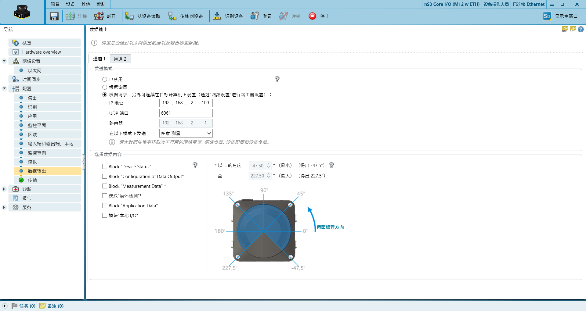
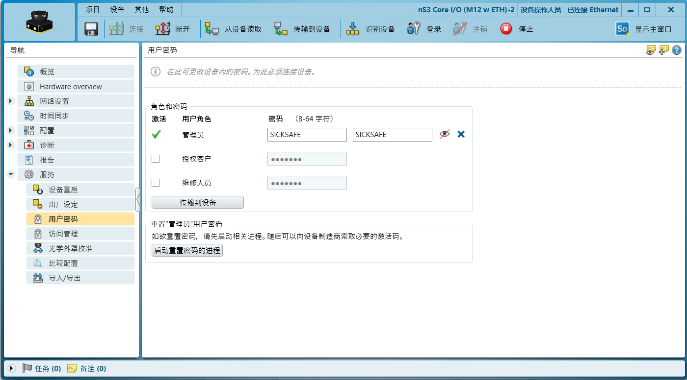
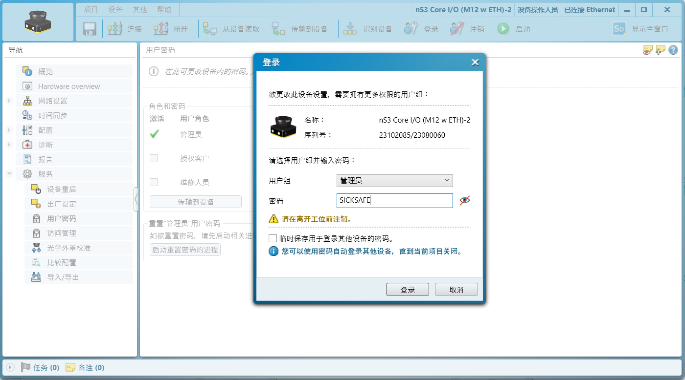

# Sick NanoScan3 配置指南

↩️[返回主页](../../../README.md)

🔗[ros驱动Github链接](https://github.com/SICKAG/sick_safetyscanners-release)

注：_仅提供基础操作的参考_

## 连接至设备

以太网连接后

打开Sick软件"Safety Designer"

__【搜索设备】__ 页面

搜索后右侧栏会出现设备，查看设备地址，将连接的笔记本电脑IP修改为同一网段，如图中设备为192.168.2.11，那么本机IP需要修改为192.168.2.x

修改本机IP后双击右侧设备，添加到左侧栏中

等待一会儿，左侧栏设备的底部应该显示“已连接”。如果迟迟不显示已连接，那么关闭软件并重启软件，搜索设备，双击添加，确保添加设备后设备框底部会显示“已连接”

设备“已连接”后，进入 __【配置】__ 页面

左侧栏中
__【概览】__ 页面
此处可以查看一些基本信息

__【网络设置-以太网】__ 页面

此处可以修改雷达IP

__【配置-区域】__ 页面

此处可以绘制雷达避障区域，可以添加不同组，并单独绘制保护区域和警告区域，可以使用方形、圆形、多边形来绘制区域

__【配置-输入端和输出端】__ 页面

此页面要设置并分配引脚，如图所示，引脚2、4设置为OSSD对安全信号输出。引脚5设置为监控结果，并设置为Hi输出。引脚6、7设置为静态输入信号

__【配置-监控事例】__ 页面

此处可以将避障区域的输入输出信号分配到各个引脚。如下图所示，首先勾选“所使用的输入端 A”，然后将区域组1（Field set 1）设置为输入条件为“0”，区域组2（Field set 2）设置为输入条件为“1”，并将Field(1)配置到OSSDs输出，Field(2)配置到通用输出端1输出。

注：_需要注意的是，此处中间设置的表格中， __【关断路径】__ 和 __【监控事例】__ 的名称不能设置为中文，否则会报错_

__【配置-数据输出】__ 页面

此处可以配置udp目标IP地址以及udp需要使用的端口号(将点云数据通过以太网传输给控制器，用于定位或其他功能)

__【配置-传输】__ 页面

此页面可以点击“传输到设备”，将修改的信息传输到设备中

传输时需要输入密码，密码默认为SICKSAFE

如果提示还没有初始化，则需要去左侧栏 __【服务】__ 中的密码管理处先设置密码（建议设置为SICKSAFE）。然后点击“传输到设备进行设置”

密码设置完毕后，再次返回 __【配置-传输】__ 尝试“传输到设备”

并在相关弹窗中点击“验证”

