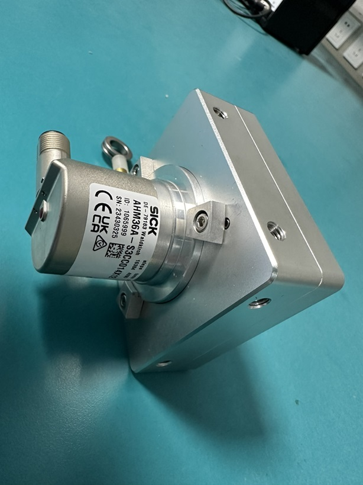
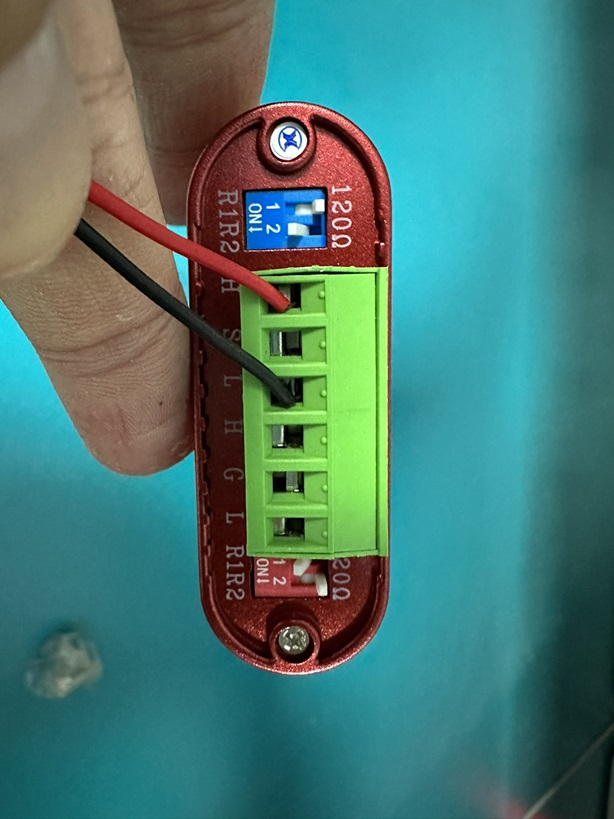
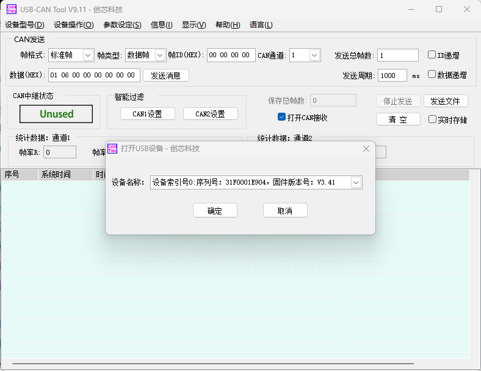

# AHM36A-S3CC014X12 配置指南

↩️[返回主页](../../README.md)

注：_仅提供基础操作的参考_

## 硬件准备

硬件 __拉线编码器__

线缆 __供电通讯__

调试器 __CAN分析仪__

接线方式 __CAN_H和CAN_L__

注: __线缆棕正蓝负供电，白CAN_H，灰CAN_L通讯__

## 开始调试

打开软件

点击 __【设备操作】-【打开设备】__

弹窗点击 __【确定】__

编码器默认初始波特率为125k bps

点击 __【确定】__ 后会显示设备打开成功

### SDO报文方式修改

注: _默认节点号为605_

__允许写入参数__
605 | 23 09 20 01 34 76 12 98

__修改节点号__
605 | 2F 09 20 02 06 00 00 00

__修改波特率__
605 | 2F 09 20 03 03 00 00 00

__保存参数__
605 | 23 10 10 01 73 61 76 65

__断电重启拉线编码器,并重启软件__

### SDO通讯

打开软件并 __【设备操作】-【打开设备】__

这次需要选择波特率250k bps，因为前面修改了波特率

__切换编码器到操作模式__
00 | 01 06 00 00 00 00 00 00

__修改计数方向，前面修改了ID为606__
606 | 2B 00 60 00 01 00 00 00

__预设当前值（零点）（不需要保存参数，直接生效并保存）__
606 | 23 03 60 00 00 00 00 00

__读取当前位置__
606 | 40 04 60 00 00 00 00 00
注：_由于传感器十分灵敏，若在零位附近小于零时，则会跳转到最大值FFFFFF03，为正常现象_

__拉出编码器部分长度后再次读取当前位置，发现有变化__
606 | 2B 00 18 05 0A 00 00 00

__设置PDO通讯间隔（不需要保存参数，直接生效并保存）__
606 | 2B 00 18 05 0A 00 00 00

__保存参数（切换到预操作状态）__
00 | 80 06 00 00 00 00 00 00

__保存参数（保存）__
606 | 23 10 10 01 73 61 76 65

__断电重启拉线编码器，因为波特率没变无需重启软件__

### 使用

__重启后可以通过如下实现单次读取，可拉去一定长度后多读几次__
606 | 40 04 60 00 00 00 00 00

__或者切换到操作模式则可开启PDO通讯__
00 | 01 06 00 00 00 00 00 00
